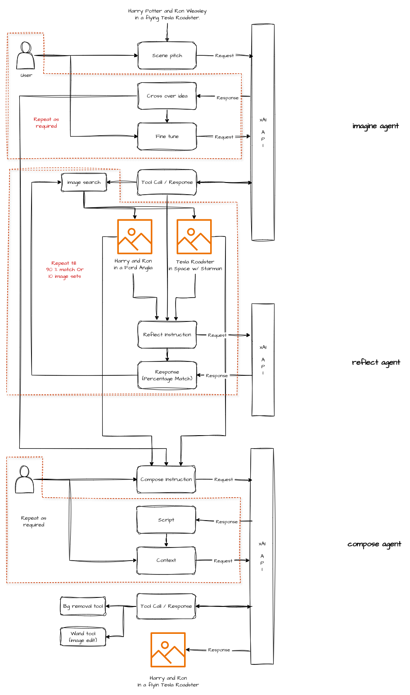

# Headconn
An image mashup that can be given to Grok Imagine to then create a fantasy version of your favourite two things.

## Sample mash up of Harry Potter and Tesla Roadster

## Idea

## System Prompt

